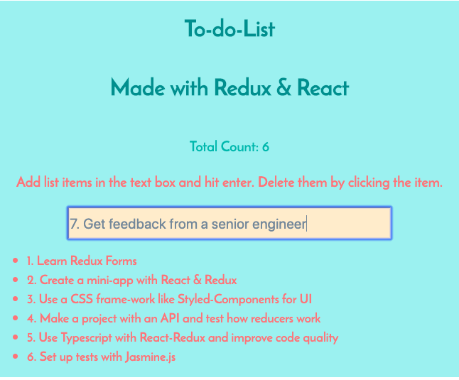

# To-do-list with Redux-React
This to-do-list with Redux-React is built with a key learning objective -
I wanted to review how Redux works with the React Library, this read-me therefore focuses on the value of using Redux



## Table of Contents
* What is Redux?
* Benefits of Redux
* Data Flows in Redux
* 5 Steps to Set up
   - Set-up Store
   - Set-up Actions
   - Set-up Reducers
   - Set-up Dispatch
   - Set-up Subscribe & Unsubscribe
* How does Redux-React render components? 
* To-do-list Project Roadmap

#### What is Redux

Redux is a way to control data-flow in an app, it was created by Dan Abramov and Andrew Clark 2015 and is influenced by ELM & React-flux.

More in this article https://medium.com/@jtbennett/standard-actions-in-redux-c6a415c8aea4

Data flows are uni-direction from a React component to the Redux store via an action (or payload) the action is dispatched to the store. 

The store holds the initial state which is sent to the reducer as a state tree. The reducer duplicates the state tree and updates the state tree with the changes specified by the actions dispatched. The duplicate and updated state-tree incorporating the actions from the actions object is sent back to the React component. The original state tree remains pristine and is never changed.

The React component subscribes to the changes from the Store with listeners. The updated state tree is decoded and the Component re-renders.

#### Benefits of Redux

- Redux is a load package manager that saves a lot of boiler plate code
- There is only one store for data (state) of the form in the redux store
- Data flows are predictable and stable as they are unidirectional (from parent to child)
- They follow the same lifecycle method in a predictable pattern
- It solves the problem in React where data can only flow from the parent to the child, therefore can not flow from the child to parent, grandparent or sibling components
- Redux scales an app when there is a need to change state in multiple places. 
- Redux is the next step in the app data-management complexity curve Browser-based data in DOM / react-js (data in state in components/ virtual DOM) / react-redux (only one set of state in store, no data in components)

#### Data Flows in Redux

Data flows from components via actions to store (with Redux-forms through higher order components (HOC’s)
From store via dispatch actions back to the  React component
Component subscribes and unsubscribes to changes (higher order components have specialised methods to handle API payloads)
Component renders

#### 5 Steps to Set Up

##### Step 1: Set-Up Store

- Store is an object
- It holds state, which is immutable in one place, preventing “ghost” instances of data (state) in the app
- It is the one source of truth (stable data and eliminates ‘lurking’ copies of state in the app)
- It has a base dispatching function that synchronously sends the action object, along with the state tree to the reducer function
- Components send information to the store via actions
- Redux forms need additional set up to work with store through some specialised methods and higher order components (HOC’s). The reduxform() method takes the form configuration object and returns a new function that wraps the changes coming in specifically from form actions
- There are three states in the store:-
  - Pristine (default state)
  - Touched
  - Error - returns rejected props based on custom functions and the conditions written into those functions

Map functions are used to transport data as they create a duplicate copy of the information without transforming the original information

#### Step 2: Set-Up Action Payloads 

- Actions are objects that represent the intention to change state
- Actions are the only way to get data from components into the store
- Actions always have a type - it is recommended that it type is a string constant as strings can be serialised
- With forms (and their higher order components) the form type is the ```<Field>``` type
- Action payloads represent the data related to the action
- Actions represent the value parameter passed into the reducer method, store is the accumulator
- Actions are the values passed to the reducer method via the store, along with the the state-object which is the state-tree in the store

#### Step 3: Set-Up Reducers

- Reducers or the reducing function reduce the collection of values of the actions to one action
- It is a use case for the higher order function ```reduce(fold)/ array.reduce()`` method where multiple values are passed with the view to getting a single new value without changing the state of the original data passed in
- Several reducers can be combined into a single root reducer with the ```combineReducers()``` method
- Under the hood, the reducer mthod has an accumulator and a value and a call back function ```reducer(accumulator, values){}`` the accumulator is the state tree, values are the actions 
- With forms the ```formReducer()``` method is used, it is the specialised reducer that gets its information from actions related to higher order components that send the form payloads to the store.
- The ```combineReducers(){}``` method for the root reducer, calls all child reducers and gathers their result into one function, keys of the action correspond to the keys of the passed reducer function
- State is changed by reducers (pure functions with no side-effects) takes (current) state (also known as modified or touched, pristine state is the original state tree that never gets modified, only duplicated)
- Once the pristine state has been duplicated, it is duplicated or "touched" and modified by a series of switch statements to execute the actions payloads sent to the store. The switch statemnt makes sure that both the type and the arguments on either side of the conditional operator are absolutely true (both in type and in from) and then returns the new state tree to the component requesting (subscribing for) the update

Some general rules for reducer functions: -
- Reducer changes state via pure functions
- The functions written in a reducer determines the changes needed or how state can be mutated - usually done with conditionals (switch)
- If no change is needed the previous state is returned to the component and no updates are made
- Root reducer combines all the changes required from multiple reducer functions
- Pure functions means no api-calls, routing transitions returned in the reducers
- Functions with dependencies like Math/ date functions (math.random/date.now) can not be passed

#### Step 4: Set-Up Subscribe/ Unsubscribe 

The components that need to be aware of state subscribe to the store
- components are set up with listeners to subscribe to these payload changes via the subscribe(listener) method
- they unsubscribe by switching the listener off

Components listen for changes and switch from subscribe (listening to changes and performing the render function according to these changes) and unsubscribing when the changes have been executed

With forms, higher order components (HOCs) connect the form components to the store object. Form components have several event listeners, the Redux form method looks at all of these event listeners and ensures that the higher order components are set up to register listeners of events and unregisters these listeners in the Store.

This is specifically important for the ```handleSubmit``` (onSubmit) event handler. On keyboard, mouse and other changes are also important to track form engagement via user experience events. 

This higher order component, is exported at the bottom of the form - ```export default reduxForm({})```

##### A little more about the special case of the event handler onSubmit

Submitting all a forms information (data) has a chaining method to handle the submission of the information, spotting errors in the submission and catching these errors. Submission is with the values described by the user.
```OnSubmit(values)``` are passed as a JSON object. They need custom functions to handle both state (the values or data submitted) and validation (that the values and data submitted are correct). The error code block is a custom block that returns rejected props based on certain conditions and on 

```
- .then()
- .throw new Submission Error({})
- .catch()
```

#### Step 5 : Set-Up Dispatch

The dispatch function is the only way to trigger a change in state.
The function when run - either sends the action and state tree data to the reducer to be transformed.

The dispatch method can also call the reducer function
 
 When it calls the reducer function, it 
 - notifies component listeners to the “next” change in the state tree 
 - rejects the props with errors and dispatches error messages 
 - maps the “next” change in the state tree to the component 
 
 When it dispatches actions and state to the reducer, there are custom functions that are written in Middleware (like Thunk) and passed to the base-dispatch function. Custom dispatch function accepts sync or async actions via middleware. Middleware wraps the base dispatch function and can transform, delay, ignore, the payload, and pass the information down the middleware queue of data. Middleware will eventually dispatch a plain object actions using the dispatch method.

The base dispatch function always synchronously sends actions to the stores reducers along with the state tree to calculate the new state, actions are plain objects ready to be consumed by the reducer

Once the store receives the information from actions and converts these actions that update state the new state needs to be dispatched back to the components via the dispatch method.

The dispatch method therefore takes the information from the reducer and dispatches it back to components.

The store receives the map methods and via the dispatch(action) method converts the action payload to the dispatch payload

Set up Dispatch changes to the components that have subscribed to the changes
```store.dispatch(action)``` function, the ```mapDispatchToProps(dispatch)`` sends user data like admin fields, how toggles change, error handling to the component.

### How does Redux-React render components and pages?

These dispatch functions are connected via the ```{connect}``` higher order component import to the counter component and exported back to the store and the ```Provider``` component.  Provider wraps the Redux HOC into the Redux library framework.

Writing the render functions wrapped in the Provider tag 
- Displays data from stateful components via props to stateless components
- The stateless components are routed to Index.js, which registers the ReactDOM.render() method which registers the react virtual DOM
- Redux is a wrapper in the React library via the Provider HOC, so it is passed as a prop of the react main.js (or app.js) component

- If any change is required to the stateless component, actions need to be created to send them back to the stateful component and the whole cycle starts again


### To-Do-List Project Roadmap
##### Package set up
create-react-app “name of project”
npm install redux react-redux  --save
Check in package j-son
yarn start serve
control alt i open console

#### Files set up
*  React-Component to render in main App (lister) several components possible
*  Redux store with reducer and action set up for initial state (index) only one store possible
*  Connect the component to store (connect prop)

## Data-flow in the app:

1. Component (lister) creator-action (payload) written for store reducer
2. Creator-action(payload) is dispatched to the store with the map functions (mapStateToProps and mapDispatchToProps)
3. Store picks up the creator-action - runs the reducer functions (switch function conditions)
4. Update in state is passed via dispatcher-action (new-payload) to component 
7. Component subscribes/ or unsubscribes to dispatcher-action(new-payload) - the onChange, onSubmit, handleClick event listeners
8. Component updates and renders view of the dispatcher-action (payload)

## Refactoring

* Use of constants to manage actions and eliminate spelling mistakes from component (lister) naming convention and store naming in the reducer (index)

* Use of the provider - assign store to multiple components

## Steps to create to-do-list with code 

1. Create react component (lister) and import it into main app - console log render and props as test
```
import React from 'react';

function Lister(props) {
	console.log('render', props);
	return (
		<div>
			<h1>To-do with react-redux</h1>
			<form>
				<input />
				<ul>
					<li>1</li>
					<li>2</li>
				</ul>
			</form>
		</div>
	);
}

export default Lister;
```

2. Create store with reducer (index) import into main app - console log reducer action as test 

```
import { createStore } from 'redux';

const initialState = {
	text: '',
	items: []
};

const reducer = (state = initialState, action) => {
	console.log('reducer', action);
	return state;
};

const store = createStore(reducer);

export default store;
```

3. In main app check console for redux-init
```
import React from 'react';
import './App.css';
import Lister from './lister';
import store from './store/';

function App() {
	return (
		<div className="App">
			<Lister store={store} />
		</div>
	);
}

export default App;
```

4. Connect react and redux with the connect prop imported from react-redux to component(lister)- check updates in console

Remove hard-coded test in state from the index in store
Use the mapStateToStore method in the component (lister)
The connect prop and method have to to be passed into the export default section

```
import React from 'react';
import { connect } from 'react-redux';

function Lister(props) {
	console.log('render', props);
	return (
		<div>
			<h1>To-do with react-redux</h1>
			<form>
				<input />
				<ul>
					<li>1</li>
					<li>2</li>
				</ul>
			</form>
		</div>
	);
}

function mapStateToProps(state) {

	return {
		text: state.text
	};
}

export default connect(mapStateToProps)(Lister);
```

In the store(index) add text to the input field and check if the empty string in the console updates with the data input in state

```
import { createStore } from 'redux';

const initialState = {
	text: 'test',
	items: []
};

const reducer = (state = initialState, action) => {
	console.log('reducer', action);
	return state;
};

const store = createStore(reducer);

export default store;
```

5. From component (lister) Dispatch the creator-action to store - mapDispatchToProps function - check input change in console, add the handleInputChange function for onChange event (listener)

With the onchange updated, test with text updates in the input field to see if state is changing

```
import React from 'react';
import { connect } from 'react-redux';

function Lister(props) {
	console.log('render', props);
	return (
		<div>
			<h1>To-do with react-redux</h1>
			<form>
				<input
					name="list-input-field"
					className="list-input-field"
					type="text"
					value={props.text}
					onChange={props.handleInputChange}
				/>
				<ul>
					<li>1</li>
					<li>2</li>
				</ul>
			</form>
		</div>
	);
}

function mapStateToProps(state) {
	console.log('mapStateToProps', state);
	return {
		text: state.text
	};
}

function mapDispatchToProps(dispatch) {
	return {
		handleInputChange: (event) => {
			console.log('change');
			//event.target.value
			const action = { type: 'CHANGE_INPUT_TEXT', text: event.target.value };
			dispatch(action);
		}
	};
}

export default connect(mapStateToProps, mapDispatchToProps)(Lister);


```

6. Update store with reducer action with switch condition - test more than one letter fires in input field in console

```
import { createStore } from 'redux';

const initialState = {
	text: '',
	items: []
};

const reducer = (state = initialState, action) => {
	console.log('reducer', action);
	switch (action.type) {
		case 'CHANGE_INPUT_TEXT':
			return Object.assign({}, state, { text: action.text });
		default:
			return state;
	}
};

const store = createStore(reducer);

export default store;
```

7. In component (lister) add 2nd creator-action - handleSubmit event (listener)
* add the prevent default to the function
* refactor the form - separate the list-items
* in the mapStateToProps function - map the items and the index key from state (array) to props
* use destructed props, array items, index key and map them into the ul-jsx tag to render the li-jsx items
* use the handleSubmit function in the form onSubmit event handler

```
import React from 'react';
import { connect } from 'react-redux';

function Lister(props) {
	console.log('render', props);
	return (
		<div>
			<h1>To-do with react-redux</h1>
			<form onSubmit={props.handleSubmit}>
				<input
					name="list-input-field"
					className="list-input-field"
					type="text"
					value={props.text}
					onChange={props.handleInputChange}
				/>
			</form>

			<ul>
				{props.items.map((item, index) => {
					return <li key={index}>{item}</li>;
				})}
			</ul>
		</div>
	);
}

function mapStateToProps(state) {
	console.log('mapStateToProps', state);
	return {
		text: state.text,
		items: state.items
	};
}

function mapDispatchToProps(dispatch) {
	return {
		handleInputChange: (event) => {
			console.log('change');
			//event.target.value
			const action = { type: 'CHANGE_INPUT_TEXT', text: event.target.value };
			dispatch(action);
		},

		handleSubmit: (event) => {
			console.log('submitting');
			event.preventDefault();
			const action = { type: 'ADD_LIST_ITEM' };
			dispatch(action);
		}
	};
}
export default connect(mapStateToProps, mapDispatchToProps)(Lister);
```

8. In store update the dispatcher-action in the switch statement - add an empty string to replace the array items in the text input so that it clears down when the handleSubmit function fires, this will clear the input field for the next input in the array

```
import { createStore } from 'redux';

const initialState = {
	text: '',
	items: []
};

const reducer = (state = initialState, action) => {
	console.log('reducer', action);
	switch (action.type) {
		case 'CHANGE_INPUT_TEXT':
			return Object.assign({}, state, { text: action.text });
		case 'ADD_LIST_ITEM':
			return Object.assign({}, state, {
				items: state.items.concat(state.text),
				text: ''
			});
		default:
			return state;
	}
};

const store = createStore(reducer);

export default store;
```

9. Refactoring - create constants file in store - it is an object with a list of constants import it into the store (index) and into the component (lister) 

```
export default {
	CHANGE_INPUT_TEXT: 'CHANGE_INPUT_TEXT',
	ADD_LIST_ITEM: 'ADD_LIST_ITEM',
	DELETE_LIST_ITEM: 'DELETE_LIST_ITEM'
};
```

10. Delete items with the handleClick function

* set up component creator-action and dispatch to store
* set up event handler and test working
* pass the index of the item you want deleted into the handleClick event and into the params of the handleDelete function 

```
			<ul>
				{props.items.map((item, index) => {
					return (
						<li key={index} onClick={() => props.handleDelete(index)}>
							{item}
						</li>
					);
				})}
			</ul>
```

```
function mapDispatchToProps(dispatch) {
	return {
		handleInputChange: (event) => {
			console.log('change');
			//event.target.value
			const action = { type: constants.CHANGE_INPUT_TEXT, text: event.target.value };
			dispatch(action);
		},

		handleSubmit: (event) => {
			console.log('submitting');
			event.preventDefault();
			const action = { type: constants.ADD_LIST_ITEM };
			dispatch(action);
		},
		handleDelete: (index) => {
			console.log('delete working');
			const action = { type: constants.DELETE_LIST_ITEM, index: index };
			dispatch(action);
		}
	};
}
```
* update store dispatcher-action in switch function

```
const reducer = (state = initialState, action) => {
	console.log('reducer', action);
	switch (action.type) {
		case constants.CHANGE_INPUT_TEXT:
			return Object.assign({}, state, { text: action.text });
		case constants.ADD_LIST_ITEM:
			return Object.assign({}, state, {
				items: state.items.concat(state.text),
				text: ''
			});
		case constants.DELETE_LIST_ITEM:
			// console.log('delete reducer working');
			const copyOfItems = state.items.slice();
			copyOfItems.splice(action.index, 1);
			return Object.assign({}, state, { items: copyOfItems });
		default:
			return state;
	}
};
```
11. Provider - assign store once to multiple components

* new functional component - header
* connect to store
* create mapStateToProps function
* export the function and the component to store
* import header into lister component
* pass store as a prop into the header component
* change console logs to separate logs from lister and footer and check console

```
import React from 'react';
import { connect } from 'react-redux';

function Header(props) {
	console.log('render header component', props);
	return <header>Total Count: {props.count}</header>;
}
function mapStateToProps(state) {
	console.log('mapStateToProps from header', state);
	return {
		count: state.items.length
	};
}

export default connect(mapStateToProps)(Header);
```

*  go to main app and import Provider (it is a component) from react-redux library
*  pass store into into the provider component add a div jsx tag for multiple components and jsx tags
*  You now can remove the header component from the lister component and add to main app with a p-jsx-tag


```
import React from 'react';
import './App.css';
import Lister from './lister';
import Header from './header';
import store from './store/';
import { Provider } from 'react-redux';

function App() {
	return (
		<div className="App">
			<Provider store={store}>
				<div>
					<Header />
					<p>Add list items in the text box and hit enter. Delete them by clicking the item.</p>
					<Lister />
				</div>
			</Provider>
		</div>
	);
}

export default App;
```

### Resources 
Documentation: https://react-redux.js.org/introduction/quick-start
Basics:(https://react-redux.js.org/introduction/basic-tutorial)
On the store: (https://react-redux.js.org/using-react-redux/accessing-store)
Redux: Crash-course https://www.youtube.com/watch?v=wjTAhHSKuPg
Traversy Media https://www.youtube.com/watch?v=93p3LxR9xfM&t=1003s

